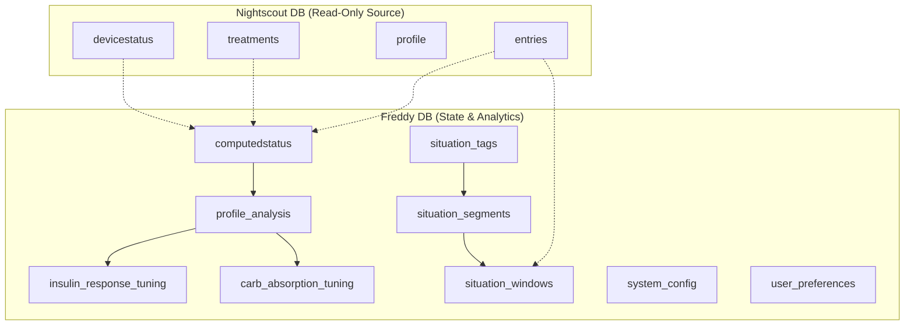

# Freddy Data Model Architecture

Freddy uses a **Direct Connection** strategy, treating the Nightscout database as a read-only secondary source while maintaining its own database for state, analytics, and service configuration.

## Database Distribution

## Entity Details

### Nightscout Owned (Direct Access)
These entities are managed by Nightscout/AAPS. Freddy queries them directly via the `NIGHTSCOUT_MONGO_URI`.

| Entity | Collection | Description |
| :--- | :--- | :--- |
| **Entry** | `entries` | Raw glucose (SGV) and activity data (HR, Steps). |
| **Treatment** | `treatments` | Insulin bolus, carbs, temp basals, and site changes. |
| **Profile** | `profile` | Basal rates, ISF, ICR, and user settings. |
| **DeviceStatus** | `devicestatus` | Pump status, battery, and OpenAPS/Loop enacted data. |

### Freddy Owned
These entities are managed exclusively by Freddy and reside in the `MONGO_URI` database (typically `freddy_db_dev`).

| Entity | Collection | Description |
| :--- | :--- | :--- |
| **ComputedStatus** | `computedstatus` | Bucketed (5m) snapshots of system state including IOB/COB. |
| **ProfileAnalysis** | `profile_analysis` | Historical ISF/ICR estimations and stability checks. |
| **InsulinResponseTuning**| `insulin_response_tuning` | History of DIA/Peak/ISF optimization runs. |
| **CarbAbsorptionTuning** | `carb_absorption_tuning` | History of ICR/Absorption optimization runs. |
| **SituationTag** | `situation_tags` | Definitions for scenarios like "Exercise" or "Stress". |
| **SituationSegment** | `situation_segments` | Time ranges where a specific tag was active. |
| **SituationWindow** | `situation_windows` | 2-4h windows used for model training and labeling. |
| **SystemConfig** | `system_config` | Core settings (NS URL, sync frequency, API keys). |
| **UserPreference** | `user_preferences` | UI settings (Units, Theme). |
